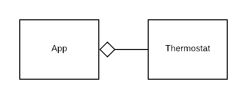

# Thermostat exercise

In this exercise we will apply the course materials from software engineering. The project will start simple and will continue to grow with features and refactorings. It is important to keep up with the extensions as they build further on the exercises that where previously made.

## Updating exercise instructions

Exercise instructions will be added as weeks pass. To get the latest instructions you need to pull them into your own project. This can be done with the following command:

```
git pull https://github.com/vives-softwareengineering-2019/thermostat.git master --allow-unrelated-histories
```

This will add or update the `exercise.md` file and its dependencies in your own project.

## Tagging releases

The exercise will continue to grow with extra features and changes. It is important to track the different states (or versions) of this project. For this we can make use of git **tags**.

At the end of every exercise you will need to _tag_ your version or commit. You can do this with the git tag command:

```
git tag v0.1
```

If for some reason you forgot to tag your version, and want to add an tag to a previous commit, you can simply add the commit hash at the end of the git tag command to tag that commit.

You can lookup previous commit by using git log:

```
git log --pretty=oneline
15027957951b64cf874c3557a0f3547bd83b3ff6 Merge branch 'experiment'
a6b4c97498bd301d84096da251c98a07c7723e65 beginning write support
0d52aaab4479697da7686c15f77a3d64d9165190 one more thing
6d52a271eda8725415634dd79daabbc4d9b6008e Merge branch 'experiment'
0b7434d86859cc7b8c3d5e1dddfed66ff742fcbc added a commit function
4682c3261057305bdd616e23b64b0857d832627b added a todo file
166ae0c4d3f420721acbb115cc33848dfcc2121a started write support
9fceb02d0ae598e95dc970b74767f19372d61af8 updated rakefile
964f16d36dfccde844893cac5b347e7b3d44abbc commit the todo
8a5cbc430f1a9c3d00faaeffd07798508422908a updated readme
```

and then add the commit hash when creating the tag 

```
git tag v0.2 9fceb02
```

All made tags can be listed using the git tag command.

```
git tag
```

Tags are created locally by default. When pushing commits to a remote you need to specifically tell git to push the tags. You can do this with the following command:

```
git push origin --tags
```

Always check on GitHub in your project that the tags are pushed correctly.

## Versions

### v0.1 Thermostat

The goal of this version is to create software solution that acts as a thermostat. Given that we have some temperatures, we would like to know what the result is. The result can be used to control a heating and cooling unit.

A thermostat can be set to a _wanted temperature_ value for a room. To prevent oscillations and improve efficiency we need to give a dead-zone or _range_ where the thermostat will neither put on the heating nor put on the cooling. Next we need to be able to give the thermostat the _current temperature_ so that it can calculate the result.


Create a small Ruby application that demonstrates the functionality of an `Thermostat` class. The application could have the following class structure.



The application (for now) can define some hard-coded temperatures. For each of those temperatures, we will pass them to the `Thermostat` and display the results in the console.

The goal of the `App` is just to verify the `Thermostat` class, and that it is able to correctly control heating and cooling units.

#### Tips

##### Directory structure

It's always a good idea to structure your files. All your classes should live inside a `lib` directory. The `app.rb` file can be placed inside the root directory. This structure will result in a clean project, it will allow you to easily find your files, and give feedback about their function.

```
thermostat-yourname
│   app.rb
└───lib
        class_a.rb
        class_b.rb
        class_c.rb
```

##### Eliminating `require_relative`

If you structure your files like the example above you  will be able to replace all `require_relative` functions by simple `require` functions. This will make your code way more portable and will handle refactoring much easier.

When running your application, the `require` statements must be able to find your files. You just have to tell the Ruby runtime that your `lib` directory should be included. This can be done by using the `-I` flag followed by the name of the directory. In this case that should become `-Ilib`

```shell
ruby -Ilib app.rb
```

##### Floats vs Integer

When testing your application, keep in mind that it should work with floating point numbers. Because of Ruby's *strong typing* you MUST supply floating point notations while testing. For example if you would like to test with the value of `20` (Integer), then you need to explicitly write `20.0` (Float). Ruby will not automatically cast the Integer into a Float or visa versa.

### v0.2 JSON Thermostat

The `Thermostat` application is cool, but in only works using the command line. The `Thermostat` should also be able to work using JSON. Many applications provide information in JSON format. Making sure our thermostat is able to receive and respond with JSON will make it usable in many more situations. 

In this version, you will create a `JSONThermostat` Class that is able to receive the settings in a JSON String, and is able to respond with a JSON String containing the result.

The `JSONThermostat` class can accept the **settings** in JSON format. The expected format is:

```json
{
  "temperature": 20.0,
  "range": 1.0
}
```

Once the `JSONThermostat` is set, it can process new values using an `update` method. The `update` method will again accept JSON using the following format:

```json
{
  "temperature": 23.4
}
```

The return value of the `update` method will output a JSON formatted `String`. An example is show below.

```json
{
  "cooling": false,
  "heating": false
}
```

#### Tests

Instead of using an `app.rb` or other application to test the behavior of the `JSONThermostat` we can me use of *Software Tests*. In the `test` directory you can find some tests that will create an instance of your `JSONThermostat` class and will run some code against it. When everything works as expected, the tests will PASS. If your implementation is not correct, the tests will FAIL. These test will give feedback on the expected behavior of your code.

To run the tests, you can execute the following command:

```shell
rake test
```

If all goes well and everything works like expected, you will get the following result:

```shell
Run options: --seed 48182

# Running:

..........

Finished in 0.004125s, 2424.1837 runs/s, 3636.2755 assertions/s.

10 runs, 15 assertions, 0 failures, 0 errors, 0 skips
```

If a test fails, you will get feedback why the test failed. For example:

```shell
Run options: --seed 64935

# Running:

F.........

Finished in 0.120293s, 83.1306 runs/s, 124.6958 assertions/s.

  1) Failure:
JSONThermostat#test_0001_should turn everything off when temperature is ok [C:/Users/sille/OneDrive/VIVES/SoftwareEngineering/oefeningen/thermostat-sillevl/test/json_thermostat_test.rb:16]:
--- expected
+++ actual
@@ -1,2 +1,2 @@
 # encoding: UTF-8
-"{\"cooling\":false,\"heating\":false}"
+"{\"cooling\":true,\"heating\":false}"


10 runs, 15 assertions, 1 failures, 0 errors, 0 skips
```

### v0.3 Adding support for units

The thermostat is getting really nice. It can already do a lot. But at the moment the thermostat only works with a single unit of temperature. It works exclusively in Celsius or Fahrenheit or Kelvin. Some sensors provide there temperature values in a different unit that is used by the user. For example, an European user will set its thermostat using Celsius, but an American sensor that is used in the system will publish its values in Fahrenheit. It would be great if the application would support an additional 'unit' value in which the values are given.

To solve this, both the `setting` and `measurement` JSON objects could have an optional property called `unit`. The unit property could contain the following values `celsius`, `fahrenheit` or `kelvin`.

If no unit is given, it will default to `celsius`.

Any combination should be supported.

For example, you could now provide the following thermostat setting:

```json
{
  "temperature": 68.0,
  "range": 1.8,
  "unit": "fahrenheit"
}
```

And update the temperature using the following format:

```json
{
  "temperature": 293.2,
  "unit": "kelvin"
}
```

The return value of the `update` method will output a JSON formatted `String`. An example is show below.

```json
{
  "cooling": false,
  "heating": false
}
```

Note that `range` is a relative temperature difference, and `temperature` is an absolute temperature value. They should not be treated the same when converting them between different units. Eg: *1 Kelvin* range is not equal to *-272.15* °C, but *1 °C*.

### v0.3-a Single responsibility analyses

To determine if your classes and methods have a single responsibility it may be a good idea to analyze them. 

First you need to document the structure of your code by creating an UML class diagram that lists all *private* and *public* methods (not the properties). You can do this in a `responsibility_analysis-v0.3.md` [file](./responsibility_analysis-v0.3.md) inside the `/docs` directory.

Then you need to determine if the code is placed in the correct location by using the methods discussed in [Determining if a class has a single responsibility](https://vives.gitbook.io/software-engineering/practical-object-oriented-design-in-ruby/designing_classes_with_a_single_response#determining-if-a-class-has-a-single-responsibility). Try to fully describe all classes and methods in one sentence, and list those descriptions in the documentation.

Next you need to mark the code that may contain multiple responsibilities.

Finaly refactor your actual code so that it only contains out of methods and classes with a single responsibility.

When done tag your version with `v0.3-a`. Note that we did not bump the version to `v0.4` because there is not functionality added, the behavior is just reordered to meet a better design.

### v0.3-b managing dependencies

Refactor your code so that dependencies are minimized. Use `dependency injection` or `dependency isolation` where needed.

Try to remove all method argument order dependencies for all your methods.

### v0.3-c code style and layout cleanup

RuboCop is a tool that will scan your code and generate some reports. In this case we are going to use it for evaluating the code style and layout of this project. Using a simple command you will get a report of the current state of your code. This report can then be used to try and resolve the issues.

Install the dependencies with the following command:

```shell
bundle install
```

Next you can run the RuboCop style and layout checker on your code by using the following rake task:

```shell
rake rubocop
```

This task will report where style and layout should be improved.

Try to cleanup and solve as much as possible
